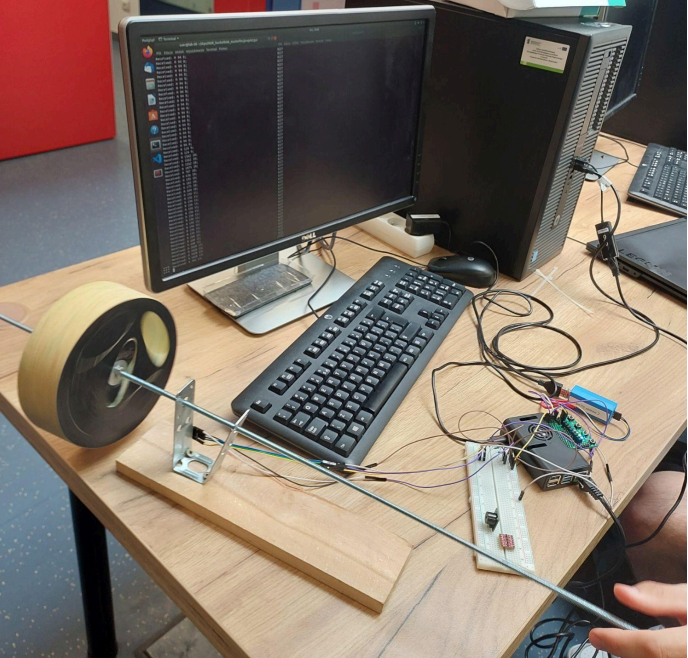

# RPMCounter
## Embedded college project for tracking wheel RPM
This project is a collage assignemnt i did with my partner. The goal of our project was to develop a real-time system on a Raspberry Pi 4 that calculates the rotational speed based on data from a distance sensor aimed at the spokes of a wheel. The system also includes an analytical tool that plots the speed over time on a separate computer and an emergency brake, which will be represented by a buzzer due to hardware limitations. The buzzer will activates when the wheel reaches a critical speed.   

## My part of the project
My part was to create hardware driver for the sensor, and app logic, my partner did the visual representation and helped with RPi4 packages on OpenWRT.
Most of my work is inside [my_functions.c](projekt/rp4/src/my_functions.c) and is implemented with the API inside [final_script_conn.c](projekt/rp4/src/final_script_conn.c)
## Sensor Measurements
We used the VL53L0 laser distance sensor. Communication with the device is through the I2C interface and ST's API.
## Time Constraints
The main time constraint for our project is the response time of the emergency brake (represented by the buzzer sound). We aim for it to activate within 1 meter at a speed of 200 cm/s, meaning the maximum tolerated delay for the buzzer is half a second. Our device performs around 100 measurements per second, and the wheel needs to rotate at least 4 times per second (its circumference is 50 cm) to reach the critical speed. The delay between detecting the critical speed and activating the buzzer is negligible, so the safety system will function within the specified limits. However, the maximum speed of the wheel is limited because the sensor’s accuracy decreases at higher speeds (spokes may skip between readings). With 100 measurements per second and at least 10 measurements needed for accurate rotation, the wheel can rotate at speeds up to 5 meters per second.
* Maximum buzzer delay: 500 ms
* Maximum wheel speed: 500 cm/s
## System Visualization
For visualization, we created a Python application that communicates with the Raspberry Pi in real-time to receive the wheel speed and plots the speed graph on the client. Additionally, the application includes an emergency button to remotely trigger the emergency brake (buzzer).
